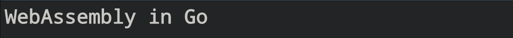

<div align="center">
<a href="Credit: https://www.andreagrandi.it/2020/10/23/getting-started-with-tinygo-webassembly/">  </a>
</div>

# Getting started WASM with Go

## What is WASM ?
WebAssembly (abbreviated Wasm) is a binary instruction format for a stack-based virtual machine. Wasm is designed as a portable compilation target for programming languages, enabling deployment on the web for client and server applications.

But what does it mean?
* It means you can compile a code written in C or Rust, for example, and execute it on the browser, at near-native speed.
* You can reuse that old code you have and be able to run it on your browser, as it was a web application.
* The WebAssembly code runs in a Virtual Machine, alongside with JavaScript. It is not a way to replace JavaScript. It’s a way to optimize and take care of performance critical components of a web application

> Credit: https://medium.com/vacatronics/how-to-write-a-webassembly-app-in-go-fd769fa2b64b

## Usage

First, Clone this project project with the command below:
```bash
$ git clone https://github.com/developer-guy/first-impression-for-wasm-with-go.git
```

Then, you need to run the server with the command below:
```bash
$ go run cmd/server/main.go
```

After the server becomes running, go the following link on the browser:
```bash
$ open http://localhost:8000
```

You will see the message on the screen that you provided within the [cmd/wasm/main.go](./cmd/wasm/main.go)
